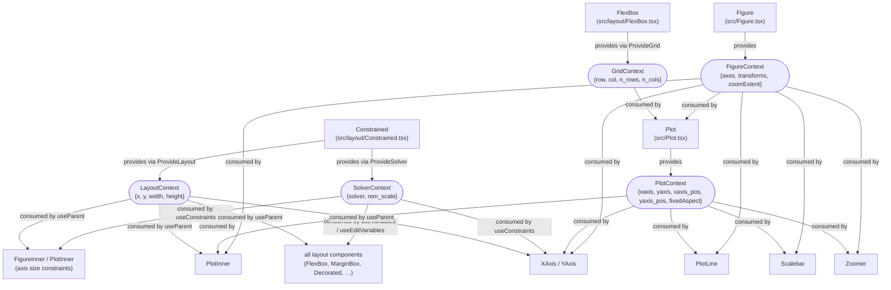
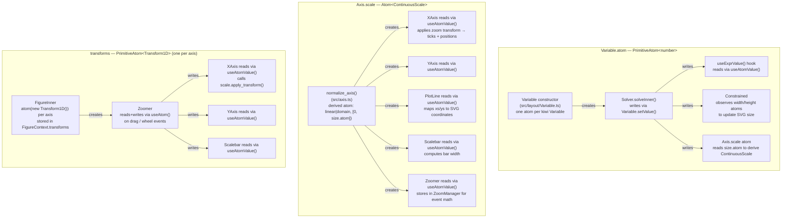

# Architecture

plotlib is a React/SVG scientific plotting library with a constraint-based layout engine.

---

## Core Architecture

The library is organized around a two-level hierarchy:

**`Figure`** (`src/Figure.tsx`) — the root component. You declare all axes here as a `Map<string, AxisSpec>`, and the figure owns the constraint solver and Jotai zoom-transform atoms. All axes are identified by string keys.

**`Plot`** (`src/Plot.tsx`) — a panel within a Figure. It binds to two named axes (`xaxis`, `yaxis`) from the enclosing Figure and handles rendering the axis decorations (tick marks, labels) on the appropriate sides. Multiple Plots can share the same axis keys, which keeps them spatially aligned automatically.

---

## Scale System (`src/scale.ts`)

A typed, immutable scale hierarchy:

| Type | Description |
|---|---|
| `Scale<T, U>` | Base interface |
| `NumericScale<U>` | Numeric domain → any range; has `ticks()`, `domain_to_unit()` |
| `SpatialScale<T>` | Any domain → numeric range; has `range_to_unit()` |
| `ContinuousScale` | Numeric → Numeric; intersection of both; has `apply_transform()` |

Public constructors: `linear()`, `log()`, `continuous()`, `numeric()`. The `numeric()` overloads dispatch to either `continuous` (numeric→numeric) or `interpolate` (numeric→color via d3-interpolate piecewise). Color scales are supported natively.

Scales are **immutable** — `with_domain()` / `with_range()` return new instances. `apply_transform(Transform1D)` recalculates the domain for a zoomed view.

---

## Layout System (`src/layout/`)

A constraint-based layout engine built on **`@lume/kiwi`** (Cassowary solver). Key components:

- `Constrained` — SVG root, observes container size via ResizeObserver, injects it as an edit variable
- `MarginBox`, `FlexBox`, `Centered`, `Decorated` — higher-level layout containers
- `Decorated` — wraps a central plot area with side decorations (axis, label) on any of the four edges
- Axis `size` is a solver Variable, allowing `Plot` to impose `width == xaxis.size` / `height == yaxis.size` as constraints. The solver then sizes all axes consistently across shared panels.

Axis sizes support a `VariableLength` type, including expressions like `["var", 0.5]` (50% of another variable), enabling proportional axis sizing.

---

## Zoom System (`src/zoom.tsx`)

`<Plot zoom>` wraps content in a `Zoomer` component, which instantiates a `ZoomManager`. It handles:

- **Drag to pan** — mouse drag translates the 2D transform
- **Scroll to zoom** — wheel event scales around the cursor point
- **`translateExtent`** — constrains panning to the axis domain
- **`zoomExtent`** — min/max zoom factors
- **`fixedAspect`** — locks x/y zoom ratio by constraining scales

Zoom state is stored as per-axis **Jotai `Transform1D` atoms**. Reactive updates propagate to the `Scalebar` (via `apply_transform`) and the SVG zoom group (via direct `setAttribute`), keeping DOM updates efficient.

---

## Components

| Component | Purpose |
|---|---|
| `PlotLine` | Renders an SVG `<path>` from `xs[]` / `ys[]` arrays; skips non-finite values |
| `Scalebar` | Floating scale bar overlay; auto-selects SI prefix (m, k, M, …), tracks zoom |
| `TextBox` | Rotatable text label, used for axis labels |
| `Plot.Clip` | Clip-path group for plot content, also applies the zoom SVG transform |

---

## State Management & Theming

- **Jotai** atoms hold per-axis scale (derived from the solver variable) and per-axis zoom transform. All reactive subscriptions go through `useAtomValue`.
- **Theming** via `ThemeProvider` + `useStyles` / `useCompoundStyles`, with CSS modules as the default. Components accept style override props (`StylesProps`, `CompoundStylesProps`).
- Context: `FigureContext` carries axes + transforms; `PlotContext` carries the active axis keys and layout configuration.

---

## Context & Atom Graph

### React Contexts

There are five React contexts. The graph shows which component provides each context and which components consume it.

### Jotai Atoms

There are three families of atoms. The graph shows where each is created, written, and read.

### Summary Table

| Context / Atom | Provided / Created by | Consumed / Written by | Read by |
|---|---|---|---|
| `FigureContext` | `Figure` | — | `Plot`, `PlotInner`, `PlotLine`, `XAxis`, `YAxis`, `Scalebar`, `Zoomer` |
| `PlotContext` | `Plot` | — | `PlotInner`, `PlotLine`, `XAxis`, `YAxis`, `Scalebar`, `Zoomer` |
| `SolverContext` | `Constrained` (`ProvideSolver`) | — | all layout hooks (`useConstraints`, `useVariables`, `useEditVariables`, `useRemScale`) |
| `LayoutContext` | `Constrained`, `FlexBox`, `MarginBox`, `Decorated`, `Centered` (`ProvideLayout`) | — | `useParent()` → `FigureInner`, `PlotInner`, `XAxis`, `YAxis`, all layout containers |
| `GridContext` | `FlexBox` (`ProvideGrid`) | — | `Plot` (controls `show='one'` axis visibility) |
| `Variable.atom` | `Variable` constructor | `Solver.solveInner()` | `useExprValue`, `Constrained` size observer, `Axis.scale` derived atom |
| `Axis.scale` atom | `normalize_axis()` (derived) | recomputed when `size.atom` changes | `XAxis`, `YAxis`, `PlotLine`, `Scalebar`, `Zoomer` |
| `transforms` atoms | `FigureInner` | `Zoomer` (on pan/zoom events) | `XAxis`, `YAxis`, `Scalebar`, `Zoomer` |

---

## Design Philosophy

- **React-first** — the public API is entirely React components and props, giving a composable, declarative interface that fits naturally into any React application.
- **TypeScript-first** — strong types throughout: the scale hierarchy, context shapes, axis specs, style props, and layout lengths are all statically typed, catching misuse at compile time.
- **Constraint-based layout, SVG rendering** — element sizing is solved by a Cassowary constraint solver (`@lume/kiwi`) rather than hard-coded geometry, allowing flexible multi-panel figures with shared axes. All output is SVG.
- **Composable state via React context** — `FigureContext`, `PlotContext`, `SolverContext`, `LayoutContext`, and `GridContext` thread shared state through the component tree without prop drilling, enabling deeply nested components (e.g. `PlotLine`) to access axes and scales transparently.
- **Cross-cutting reactive state via Jotai** — state that must be read by many unrelated components (axis scales, zoom transforms, layout variable values) is held in Jotai atoms, so updates propagate efficiently without re-rendering the whole tree.
- **Immutable objects** — scales and transforms are immutable value objects; operations like `with_domain()`, `with_range()`, and `apply_transform()` return new instances, making data flow predictable and avoiding accidental mutation.
- **Simple theming** — components accept style override props (`StylesProps`, `CompoundStylesProps`) and resolve them through a lightweight theme layer backed by CSS modules, keeping styling flexible without requiring a CSS-in-JS runtime.
