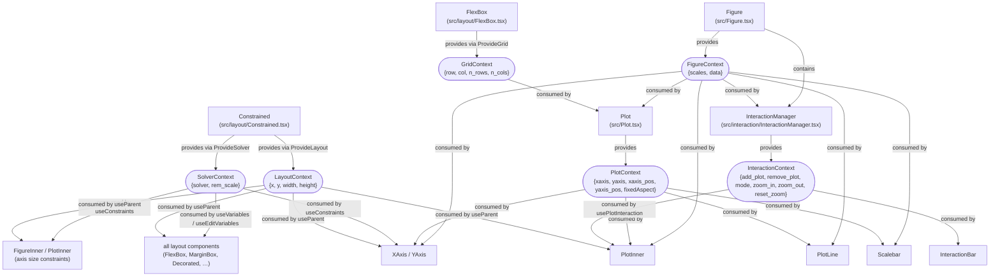
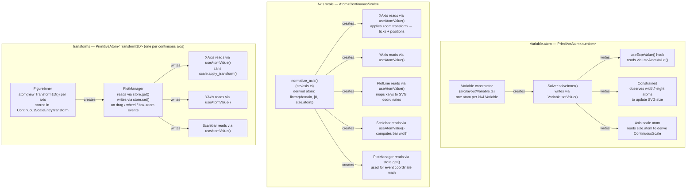

# Architecture

plotlib is a React/SVG scientific plotting library with a constraint-based layout engine.

---

## Core Architecture

The library is organized around a two-level hierarchy:

**`Figure`** (`src/Figure.tsx`) — the root component. You declare all axes here as a `Map<string, ScaleSpec>`, and the figure owns the constraint solver, Jotai zoom-transform atoms (one per continuous axis, stored inside each `ContinuousScaleEntry`), and an `InteractionManager`. All axes are identified by string keys.

**`Plot`** (`src/Plot.tsx`) — a panel within a Figure. It binds to two named axes (`xaxis`, `yaxis`) from the enclosing Figure and handles rendering the axis decorations (tick marks, labels) on the appropriate sides. Multiple Plots can share the same axis keys, which keeps them spatially aligned automatically.

---

## Scale System (`src/scale.ts`)

A typed, immutable scale hierarchy:

| Type | Description |
|---|---|
| `Scale<T, U>` | Base interface |
| `NumericScale<U>` | Numeric domain → any range; has `ticks()`, `domain_to_unit()` |
| `SpatialScale<T>` | Any domain → numeric range; has `range_to_unit()` |
| `ContinuousScale` | Numeric → Numeric; intersection of both; has `apply_transform()` |

Public constructors: `linear()`, `log()`, `continuous()`, `numeric()`. The `numeric()` overloads dispatch to either `continuous` (numeric→numeric) or `interpolate` (numeric→color via d3-interpolate piecewise). Color scales are supported natively.

Scales are **immutable** — `with_domain()` / `with_range()` return new instances. `apply_transform(Transform1D)` recalculates the domain for a zoomed view.

---

## Layout System (`src/layout/`)

A constraint-based layout engine built on **`@lume/kiwi`** (Cassowary solver). Key components:

- `Constrained` — SVG root, observes container size via ResizeObserver, injects it as an edit variable
- `MarginBox`, `FlexBox`, `Centered`, `Decorated` — higher-level layout containers
- `Decorated` — wraps a central plot area with side decorations (axis, label) on any of the four edges
- Axis `size` is a solver Variable, allowing `Plot` to impose `width == xaxis.size` / `height == yaxis.size` as constraints. The solver then sizes all axes consistently across shared panels.

Axis sizes support a `VariableLength` type, including expressions like `["var", 0.5]` (50% of another variable), enabling proportional axis sizing.

### Solver logging

`Solver` (`src/layout/Solver.ts`) emits structured `SolverLogEvent`s (`{ level, category, message, data }`) for its lifecycle: constraint/edit-variable registration, rebuilds, solves (with `durationMs` and running `solveCount`/`rebuildCount`), and errors from the underlying kiwi solver (re-thrown after logging, so behaviour is unchanged). `level` is one of `'error' | 'warn' | 'info' | 'debug'`; `category` is one of `'lifecycle' | 'constraints' | 'edit' | 'solve'`.

Diagnostics are off by default (`logLevel: 'silent'`) — zero console noise unless opted in. Two ways to turn them on:

- **`debug` prop** on `<Figure>` / `<Constrained>` — `true` sets the log level to `'debug'`; pass a specific `SolverLogLevel` (`'error' | 'warn' | 'info' | 'debug'`) for finer control. Prints to `console.debug/info/warn/error`, prefixed `[plotlib:solver]`, by default.
- **`onSolverLog` prop** — supply a custom `SolverLogSink` (`(event: SolverLogEvent) => void`) to capture events programmatically instead of (or in addition to) the console, e.g. to count solves or assert on events in tests.

At runtime, any component inside a `Figure` can call the `layout.useSolver()` hook to get the `Solver` instance directly — flip `solver.logLevel`, call `solver.printConstraints()` / `solver.printVariables()` (which always emit through the sink, regardless of `logLevel`), or read `solver.solveCount` / `solver.rebuildCount`.

---

## Interaction System (`src/interaction/`)

Interaction lives at the Figure level, not the Plot level. Key components:

- **`InteractionManager`** (`InteractionManager.tsx`) — React component wrapping Figure children; provides `InteractionContext`. Owns the figure-level `Manager` class, which holds the mode atom, the map of registered plots, and all event math (pan, scroll-zoom, box-zoom, aspect-ratio constraining, translate-extent clamping).
- **`PlotManager`** (`PlotManager.ts`) — per-plot class instantiated when a zoomed `<Plot>` mounts. Attaches `mousedown` / `wheel` / `touchstart` / `touchmove` / `touchend` / `touchcancel` listeners to the plot SVG element, subscribes to transform atoms to keep the SVG `transform` attribute in sync, and exposes `apply_transform()` to write new `Transform1D` atoms.
- **`EventListener`** (`EventListener.ts`) — thin RAII helper that tracks added listeners for easy bulk removal.
- **`InteractionBar`** (`InteractionBar.tsx`) — toolbar rendered via a React portal into the Figure container; buttons dispatch to `Manager` methods (`zoom_in_all`, `zoom_out_all`, `reset_zoom_all`, `export_figure`) and toggle the mode atom between `'pan'` and `'box-zoom'`. Its visibility is **pure CSS** — see below.

Supported interactions:
- **Drag to pan** — mouse drag or one-finger touch translates the 2D transform
- **Scroll to zoom** — wheel event scales around the cursor point; `shiftKey` / `altKey` restrict it to one axis
- **Pinch to zoom** — two-finger touch scales about the midpoint
- **Box zoom** — drag (mouse or one finger) in box-zoom mode zooms into the selected rectangle
- **`translateExtent`** — constrains panning to the axis domain
- **`zoomExtent`** — min/max zoom factors
- **`fixedAspect`** — locks x/y pixel scale factors equal

### Toolbar visibility

The `InteractionBar` is always rendered (whenever `toolbar !== false`); whether it is *seen* is decided entirely by CSS, with no JS state, atom, or gesture handling involved. `InteractionBar.module.css` sets the bar to `opacity: 0; pointer-events: none`, and `styles.module.css` lifts that on `.Figure-cont:hover`, `.Figure-cont:focus-within`, or a matching `data-toolbar` mode.

`Figure`'s `toolbar?: boolean | ToolbarMode` prop is normalized by `toolbar_mode()` (`InteractionManager.tsx`) into `'auto' | 'always' | 'hover' | null` and emitted as `data-toolbar` on the container. That single normalization is shared by `Figure` (which reserves `TOOLBAR_EXTRA_PX` of layout and tags the container) and `InteractionManager` (which renders the portal), so the two cannot disagree about whether a toolbar exists.

| Mode | Behaviour |
|---|---|
| `'auto'` (default, `true`) | Hover/focus reveal where the pointer hovers; permanently visible under `@media (hover: none)` |
| `'always'` | Never hides |
| `'hover'` | Hover/focus only, even on touch (where that means never) |
| `null` (`false`) | Not rendered; `TOOLBAR_EXTRA_PX` is not reserved |

Two things worth knowing: `TOOLBAR_EXTRA_PX = 40` reserves the bar's vertical space whenever the toolbar is enabled, *independent* of whether it is currently visible — so hiding it buys no plot area. And `:focus-within` is load-bearing rather than decorative: the bar's `<button>`s are natively tabbable even at `opacity: 0`, so without it keyboard focus lands on invisible, inert controls.

Zoom state is stored as per-axis **Jotai `Transform1D` atoms** (inside each `ContinuousScaleEntry`). `PlotManager` writes these atoms and updates the SVG `transform` attribute directly via `setAttribute`, bypassing React for DOM updates. Axis components re-render reactively via `useAtomValue`.

---

## Components

| Component | Purpose |
|---|---|
| `PlotLine` | Renders an SVG `<path>` from `xs[]` / `ys[]` arrays; skips non-finite values |
| `PlotImage` | Renders a bitmap image aligned to data coordinates |
| `Scalebar` | Floating scale bar overlay; auto-selects SI prefix (m, k, M, …), tracks zoom |
| `TextBox` | Rotatable text label, used for axis labels |
| `Plot.Clip` | Clip-path group for plot content; contains the zoom SVG group updated by `PlotManager` |
| `InteractionBar` | Floating toolbar (pan / box-zoom / zoom-in / zoom-out / reset); rendered via React portal |

---

## State Management & Theming

- **Jotai** atoms hold per-axis scale (derived from the solver variable) and per-axis zoom transform. All reactive subscriptions go through `useAtomValue`; `PlotManager` uses `store.get` / `store.set` / `store.sub` directly to avoid React overhead in event handlers.
- **Theming** via `ThemeProvider` + `useStyles` / `useCompoundStyles`, with CSS modules as the default. Components accept style override props (`StylesProps`, `CompoundStylesProps`).
- Context: `FigureContext` carries scale entries (`scales: Map<string, ScaleEntry>`) and named data atoms; `PlotContext` carries the active axis keys and layout configuration; `InteractionContext` carries plot-registration callbacks and the interaction mode atom.

---

## Context & Atom Graph

### React Contexts

There are six React contexts. The graph shows which component provides each context and which components consume it.

### Jotai Atoms

There are three families of atoms. The graph shows where each is created, written, and read.

### Summary Table

| Context / Atom | Provided / Created by | Consumed / Written by | Read by |
|---|---|---|---|
| `FigureContext` | `Figure` | — | `InteractionManager`, `Plot`, `PlotInner`, `PlotLine`, `XAxis`, `YAxis`, `Scalebar` |
| `PlotContext` | `Plot` | — | `PlotInner`, `PlotLine`, `XAxis`, `YAxis`, `Scalebar` |
| `InteractionContext` | `InteractionManager` | — | `PlotInner` (`usePlotInteraction`), `InteractionBar` |
| `SolverContext` | `Constrained` (`ProvideSolver`) | — | all layout hooks (`useConstraints`, `useVariables`, `useEditVariables`, `useRemScale`) |
| `LayoutContext` | `Constrained`, `FlexBox`, `MarginBox`, `Decorated`, `Centered` (`ProvideLayout`) | — | `useParent()` → `FigureInner`, `PlotInner`, `XAxis`, `YAxis`, all layout containers |
| `GridContext` | `FlexBox` (`ProvideGrid`) | — | `Plot` (controls `show='one'` axis visibility) |
| `Variable.atom` | `Variable` constructor | `Solver.solveInner()` | `useExprValue`, `Constrained` size observer, `Axis.scale` derived atom |
| `Axis.scale` atom | `normalize_axis()` (derived) | recomputed when `size.atom` changes | `XAxis`, `YAxis`, `PlotLine`, `Scalebar`, `PlotManager` (`store.get`) |
| `transforms` atoms | `FigureInner` (in `ContinuousScaleEntry`) | `PlotManager` (`store.set`, on pan/zoom/box-zoom) | `XAxis`, `YAxis`, `Scalebar`, `PlotManager` (`store.get`) |

---

## Design Philosophy

- **React-first** — the public API is entirely React components and props, giving a composable, declarative interface that fits naturally into any React application.
- **TypeScript-first** — strong types throughout: the scale hierarchy, context shapes, axis specs, style props, and layout lengths are all statically typed, catching misuse at compile time.
- **Constraint-based layout, SVG rendering** — element sizing is solved by a Cassowary constraint solver (`@lume/kiwi`) rather than hard-coded geometry, allowing flexible multi-panel figures with shared axes. All output is SVG.
- **Composable state via React context** — `FigureContext`, `PlotContext`, `InteractionContext`, `SolverContext`, `LayoutContext`, and `GridContext` thread shared state through the component tree without prop drilling, enabling deeply nested components (e.g. `PlotLine`) to access axes and scales transparently.
- **Cross-cutting reactive state via Jotai** — state that must be read by many unrelated components (axis scales, zoom transforms, layout variable values) is held in Jotai atoms, so updates propagate efficiently without re-rendering the whole tree.
- **Immutable objects** — scales and transforms are immutable value objects; operations like `with_domain()`, `with_range()`, and `apply_transform()` return new instances, making data flow predictable and avoiding accidental mutation.
- **Simple theming** — components accept style override props (`StylesProps`, `CompoundStylesProps`) and resolve them through a lightweight theme layer backed by CSS modules, keeping styling flexible without requiring a CSS-in-JS runtime.
